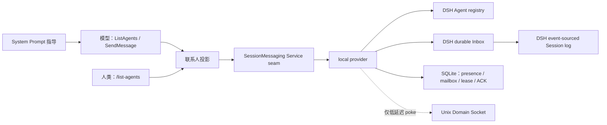

# dsh-local-session-messaging

面向 DeepSeek Harness（DSH）`0.1.0-rc.6` 的本机跨 Session 通信插件。

它提供与 Claude Code 跨会话通信相同的交互入口：

- 模型工具 `ListAgents`、`SendMessage`
- 人类命令 `/list-agents`、`/rename <name>`、`/message-permissions ...`
- 同一 DSH 进程中的多个 root Session
- 同一台 macOS/Linux 机器上的多个 DSH 进程
- 运行中的目标在下一个 step 收到消息；空闲目标在下一个 turn 收到消息并被唤醒
- 离线邮箱、重连、ACK、重试、去重、FIFO、TTL 和崩溃恢复

这里复制的是使用方式，不是 Claude Code 或 Codex 的内部架构。实现遵循 DSH 自己的 Cordis Service、Agent/Session 同一身份、event-sourced Session 和 durable Inbox 约定。唯一明确排除的是跨机器 Remote Control。

## 为什么这是 DSH 原生实现



包被拆成四类 Cordis 贡献：

- 包根导出抽象 `SessionMessaging` Service；消费者只依赖这条 seam。
- `./local` 是本机 provider，负责 Session presence、持久邮箱和 Inbox 投递。
- `./tool`、`./command`、`./prompt` 分别是模型、人类和提示词消费者。
- `./core` 只导出与 Cordis/DSH runtime 无关的 SQLite、通知器和领域类型，便于确定性测试；它不是第二套消息服务。

每个可寻址 Agent 的权威身份都是 DSH `SessionId`。PID、socket、cwd 和显示名称都不能代替身份：即使两个 Session 位于同一个 cwd，也仍是两个独立目标。名称只是一种方便的查找方式；重名、身份冲突和 split-brain 均 fail closed，不会广播或“猜一个”接收方。

需要自行创建或恢复持久 Session 的 controller，应在调用 `ctx.agents.create()` / `ctx.agents.resume()` 之前先调用 `ctx.sessionMessaging.reserveSessionWriter(sessionId)`，并在创建失败或最终 Agent detach 后释放 reservation。provider 将显式 reservation 与本进程中该 Session 的 live Agent 合并计数，因此不会在 create/resume 的持久化准备阶段与另一个进程同时写同一份 Session log。

这个 writer fence 复用同一个 SQLite 文件中的独立 owner row，不是新的消息通道，也没有 heartbeat、TTL 或后台任务。接管只接受旧 owner 的精确 release，或同机 PID、进程启动身份和系统 boot identity 对旧进程死亡的机械证明；mailbox presence 过期和 socket 断开都不能授权接管。

### 投递边界

1. 发送方把一个带稳定 UUID 的 envelope 提交到 SQLite；提交后状态为 `queued`。
2. Unix Domain Socket 尝试发送一个无载荷 poke；poke 丢失、重复或连接失败不会改变消息状态，周期轮询会恢复进度。
3. 发送时读取 fresh presence：目标为 `running` 就把 envelope 的 delivery mode 固化为 `steer`，否则固化为 `followup`。重试不会按稍后的瞬时状态改写这个决定。
4. 接收方用自己的 presence fence 和短 lease 领取消息，再用 envelope UUID 作为 DSH `MessageId` 写入 Inbox；`steer` 在最近的后续 step 边界领取，`followup` 打开新的 turn 并唤醒 Agent。
5. Inbox 插入后必须完成 `await ctx.sessions.flush(agent.session)`，SQLite 才记录 `accepted` ACK。
6. DSH 发出 `agent/inbox/claimed` 后，provider 完成一次 Session flush 才在 SQLite 记录 `claimed`。即使后续 pre-step 拒绝、没有追加 `user/message`，这个 Inbox claim 仍然成立；它不表示模型已经处理完或任务已经完成。

插件不发明新的 Session Event 类型。接收消息以 DSH 内建 `agent/inbox/spliced` 进入持久日志，来源元数据使用可扩展的 `MessageSourceMap`：

```ts
{
  kind: 'local-session-relay',
  form: 'relay',
  senderSessionId, // 实际发起 SendMessage 的 Agent Session
  replySessionId,  // 可寻址、可回复的 root Session
  senderName?,     // 发送时的可信标题快照
  envelopeId,
  replyTo?,
}
```

DSH 的 LLM adapter 只把 `content` 送给模型，结构化 `MessageSource` 主要服务于持久日志和 UI。因此 provider 还会仿照 DSH 原生 subagent report，在正文最前面加入一段不可由 `message` 参数覆盖的发送方框架，例如 `Local Session "Method A" (<root-session-id>) sent a message:`。若实际调用者是这棵 root 下的 descendant Agent，框架会同时写出 `via Agent <child-session-id>`：审计归因仍指向真实 child，回复地址则明确指向 root，不会把 child 产出的内容错误归因给 root。

SQLite transport 是至少一次；在同一 envelope id/内容摘要下，DSH Inbox admission 是去重的。若进程在 Inbox flush 后、写 ACK 前崩溃，恢复逻辑会先与 Inbox/Session log 对账，再确认原 envelope，而不是生成第二条用户消息。相同 id 配不同摘要是 collision，直接失败。

### 状态含义

| 状态 | 含义 |
|---|---|
| `queued` | envelope 已持久提交，仍可能等待目标上线或重试。 |
| `accepted` | 消息已进入目标 DSH Inbox，且 Session flush 已完成。 |
| `claimed` | DSH 已从 Inbox 领取消息进入一个 turn/step。 |
| `failed` | 重试预算耗尽、发生不可恢复冲突，或 Inbox 明确丢弃。 |
| `expired` | 消息在被接受前超过 TTL。 |

`queued`、`accepted` 和 `claimed` 都不是“接收方任务完成”。`SendMessage` 只返回当前投递 receipt，不等待另一 Session 的回答。

## 安装

### 1. 构建这个 checkout

需要 DSH `0.1.0-rc.6`、Node.js `^22.19.0` 或 `>=24`，以及 macOS/Linux。

```sh
cd /absolute/path/to/dsh-local-session-messaging
pnpm install --ignore-scripts
pnpm run verify
```

### 2. 安装到目标 profile

下面以 `web` profile 和本地 checkout 为例。若该 profile 已在运行，先正常结束它；bundle 列表在启动时组合，安装或卸载后应重新启动，而不是假设现有进程已经热切换：

```sh
dsh plugin --profile web add "/absolute/path/to/dsh-local-session-messaging"
```

`dsh plugin` 会从本包的 `dsh.bundle.patch` 元数据自动登记 bundle，并读取 [`cordis.patch.yml`](./cordis.patch.yml)，一次装载 provider、工具、命令和 prompt；不要再手工编辑 profile 的 `dsh.profile.bundles`。

本地目录安装会在 profile manifest 中记录一个指向该绝对路径的 `link:` 依赖，适合当前 checkout 的开发和本机长期使用；安装后不要移动或删除这个目录。需要与源码目录解耦时，应安装发布到 registry 的固定版本，或把 `npm pack` 生成的 tarball 放在稳定路径后再安装。

DSH rc.6 的 profile 设置了 `autoInstallPeers: false`，所以 `pnpm` 在 `add` 过程中可能打印 missing-peer warning。这不是要求你向 profile 再安装一套 DSH：DSH 会把当前安装版本的依赖闭包放进 `$DSH_HOME/profiles/node_modules`，供 out-of-tree 插件按普通 Node 规则解析。以下面的组合配置和 Web 启动检查作为装载门槛；不要用手工补装另一份 Cordis/DSH peer 的方式消除提示。

安装后先检查最终组合，再启动：

```sh
dsh --profile web --dump-config
dsh web
```

隔离安装 smoke 已验证：执行上述 `dsh plugin ... add <project-root>` 后，`--dump-config` 会直接包含 `dsh-local-session-messaging/local`、`tool`、`command`、`prompt` 四个条目，Web profile 可返回 HTTP 200。

仅在开发自定义 profile composer、刻意绕过 `dsh plugin` 时，才把本包作为普通依赖并手工合入 `cordis.patch.yml` 的四个条目；手工 patch 与 bundle 安装仍然二选一。

在任意 Session 中运行 `/list-agents`，或让模型调用 `ListAgents`。DSH 自带的小写 `list_agents` / `send_message` 仍属于原生 subagent 控制面；本插件的大写工具提供跨独立 Session 与直接 subagent 的合并视图，不会覆盖或卸载原生工具。

## 配置

本包的默认 bundle 将 provider 数据放在 `dshHomePath('local-session-messaging')`。若在 profile patch 中覆盖 provider 行，DSH 会替换该行的整个 `config`，因此要保留 `root`：

```yaml
- id: local-session-messaging-provider
  config:
    root: !!js dshHomePath('local-session-messaging')
    # 在这里覆盖其他可选字段
```

| 字段 | 默认值 | 约束与用途 |
|---|---:|---|
| `root` | `$DSH_HOME/local-session-messaging` | owner-only 状态目录；可使用绝对路径或 `~` 路径。 |
| `heartbeatIntervalMs` | `1000` | presence 心跳周期，整数且至少 `50`。 |
| `presenceTtlMs` | `5000` | presence 过期时间，整数且至少 `250`，并且必须大于两倍心跳周期。 |
| `pollIntervalMs` | `1000` | SQLite mailbox 兜底轮询周期，整数且至少 `50`。 |
| `deliveryLeaseMs` | `30000` | 一次接收投递的 fence-bound lease，整数且至少 `250`。 |
| `retryBaseMs` | `250` | 指数退避基数，非负整数；`0` 表示立即重试。 |
| `retryMaxMs` | `10000` | 单次退避上限，正整数且不小于 `retryBaseMs`。 |
| `messageTtlMs` | `604800000`（7 天） | 未接受消息的 TTL，整数且至少 `1000`。 |
| `maxAttempts` | `20` | envelope 最大投递尝试次数，正整数。 |
| `maxMessageBytes` | `262144`（256 KiB） | `message` 的最大 UTF-8 字节数，正整数。 |
| `ackWaitMs` | `1500` | durable enqueue 后，`SendMessage` 最多等待接收 ACK 的时间；`0` 表示不等待。 |
| `ackPollMs` | `50` | ACK 等待期间查询 SQLite 的周期，正整数。 |
| `socketTimeoutMs` | `500` | 一次 UDS poke 的连接/发送超时，正整数。 |

这些时间值都以毫秒计。配置关系必须满足 provider 的 schema 约束；不安全的目录权限、过短的 lease/TTL 组合或不支持的平台会在装载时直接失败，而不是静默降级。

## 使用

### 人类查看目标

```text
/list-agents
```

列表合并两类联系人：

- 其他本机 root Session，包括同进程其他 root 和共享 mailbox 中已知的其他进程 Session。
- 当前 Session 的直接 DSH subagent；continuable 子 Agent 可接收消息，one-shot 子 Agent 只列出但不可发送。

优先使用完整 `SessionId`。按名称发送只在当前联系人快照中唯一时成立；名称歧义会返回 `AMBIGUOUS_TARGET`，且不会写入 mailbox。

列表里的 `sendable` 是面向当前调用者、按当前 ACL 计算的瞬时提示；允许离线入队的 Session 即使显示 `disconnected` 仍可为 `sendable`。权限可能在列表读取后变化，最终结果以 `SendMessage` 的 SQLite 事务检查为准。

### 人类重命名当前 Session

```text
/rename Backend Worker
```

该命令直接调用 DSH 官方 `sessionTitle.rename()`：由 title service 负责空白和控制字符规范化、UTF-8 上限校验，并追加用户来源的 `session/title` 事件。显式重命名会钉住标题，后续自动标题生成不会覆盖它；DSH 的显式 title refresh 仍可有意解钉。新标题会成为其他 Session 联系人列表中的显示名称，但持久身份仍是原 `SessionId`。

### 人类控制通信权限

本插件提供的权限修改入口只存在于人类 command surface；模型工具 `ListAgents` 和 `SendMessage` 不具备更改 ACL 的能力。

```text
/message-permissions
/message-permissions status
/message-permissions send off
/message-permissions send on
/message-permissions receive off
/message-permissions receive on
/message-permissions block Backend Worker
/message-permissions unblock Backend Worker
/message-permissions blocks
```

- `send on|off` 是当前 root Session 子树发送 text/control 的共同总开关。
- `receive on|off` 是当前 root Session 子树接收 text/control 的共同总开关。
- `block <id|name>` 建立两个 root Session 子树之间的对称自由文本隔离边；机械 control 不受 pair block 影响。
- `unblock <id|name>` 删除该对称隔离边；名称必须唯一，建议使用完整 `SessionId`。
- `blocks` 列出当前对称隔离边。

Autoresearch 中让两个方法 Session 保持独立、但都向一个 coordinator 汇报，可以使用星型拓扑。先用 `/list-agents` 取得稳定的完整 `SessionId`，然后只需在任意一个方法 Session 中建立一次对称 block：

```text
# 在 method-a Session 中
/message-permissions block <method-b-session-id>

# 可选：在 method-a 与 method-b 中分别执行，形成只出不进的盲评 worker
/message-permissions receive off
```

block 会同时禁止 `method-a -> method-b` 与 `method-b -> method-a`，并覆盖两边各自的整棵运行时 subagent 子树；它不会阻断任一方法 Session 向未被 block 的 coordinator 发送报告。若两个方法 worker 仍需接收 coordinator 的问题，就保持 `receive on`；若更看重严格盲评，双方都设为 `receive off`，它们仍可向 coordinator 发送，但 coordinator 也不能在锁定结果前把一边的信息转回另一边。

缺省策略为 send/receive 全部开启。全局方向策略与 peer block 持久保存在 SQLite，是 ACL 真源；delivery lease acquisition 是一次 admission linearization。关闭方向或新增 block 时，受影响且尚未进入 active delivery lease 的 `queued` text 会原子转为 `failed`；queued control 保留到 fenced receiver，在调用 handler 前把方向撤权持久记录为 `rejected` outcome。pair block 始终只作用于 text。已经持有 lease 的 text attempt 不会被数据库硬改状态，而由接收方在 Inbox admission 前复查 ACL 并失败。provider 同时 poke 各接收进程（poll 仍是兜底）；若 text 已经写入 Inbox 并成为 `accepted`、但尚未 claim，则接收 pump 执行 `inbox.remove()` + Session flush，追加 canceled 事实后转为 `failed`。已经 `claimed` 的 DSH 历史事实不可追溯撤回。command 设置 `recordInput: false`，不会把原始策略表达式或目标字符串重复写进 `command/run`。新发送在 SQLite 事务内检查适用策略，拒绝使用 `PERMISSION_DENIED`，不会产生半条消息。

### 模型协调

典型提示：

```text
把这个 API 接口的修改通知给 test-session。
```

模型会在需要时先调用 `ListAgents`，再调用：

```json
{
  "recipient": "test-session",
  "message": "API /v2/jobs 的 response 新增了 required 字段 run_id。"
}
```

回复一条已有消息时可附带 `reply_to`。插件的 system-prompt 贡献同时要求模型避免无意义 ACK ping-pong、紧密轮询、泄露秘密和无界自主对话。

### 内部 typed control seam

需要在 Session 间执行机械控制、且绝不能把内容送进模型上下文的插件，可以直接依赖包根的内部 service seam：

```ts
import { controlPayloadHash } from 'dsh-local-session-messaging'

const unregister = ctx.sessionMessaging.registerControlHandler('example.pause', {
  authorize: control => allowedEdges.has(
    `${control.senderPrincipalSessionId}->${control.recipientPrincipalSessionId}`,
  ),
  handle: async control => {
    await pauseLocally(control.controlId, control.payload)
    return { status: 'completed', result: { paused: true } }
  },
})

const payload = { assignmentId: 'a-17' }
const receipt = await ctx.sessionMessaging.sendControl(caller, {
  controlId: crypto.randomUUID(),
  recipient: targetSessionId,
  kind: 'example.pause',
  payload,
  payloadHash: controlPayloadHash(payload),
})
```

- `controlId` 是调用者提供的稳定 UUID；相同 ID 和相同不可变信封会去重，ID 被用于不同信封会失败。
- canonical JSON 的 SHA-256 在发送前和接收处理前各校验一次。
- control 复用同一 SQLite mailbox、presence fence、lease、UDS poke、轮询和重连路径，但不调用 `followup`、`steer` 或 DSH Inbox，因此不会唤醒 LLM。
- handler 与 authorizer 都必须显式注册；从未注册的 kind 或 authorizer 返回 false 时持久拒绝。一个已知 kind 在 handler 生命周期卸载后保持无副作用的有限重试，下一实例重新注册时继续处理同一 control-id，避免 Controller 换 owner 的短窗口把可重放控制永久写成 rejected。send/receive 是 text/control 共同总开关；pair block 仅隔离自由文本，不会误伤已授权的审核 control。
- handler outcome 与消息终态在一个 SQLite 事务中持久化，可用 `getControl()` 查询。handler 异常使用现有有界退避重试；因此 handler 必须以 `controlId` 实现幂等，以覆盖“本地副作用完成、outcome 提交前进程崩溃”的不可消除窗口。
- 这个 seam 没有模型工具或人类命令入口；具体 control kind、授权图和科学流程由上层插件定义。

## 断线、重连和崩溃语义

- **目标离线**：消息留在 SQLite；插件不会擅自 `agents.resume()` 一个离线 Session。目标按 DSH 正常流程恢复并注册同一 `SessionId` 后，邮箱继续投递。
- **socket 断开**：UDS 不携带 envelope 或 ACK，失败只损失一次低延迟提示；轮询继续工作。
- **进程重启**：随机 `instanceId` 代表一次进程生命期；`SessionId` 的单一 owner 由 presence lease 和单调 fence token 保护。
- **旧进程复活**：过期 owner 的 heartbeat、delivery lease 和 ACK 都因 fence 不匹配而失败。
- **接收端中途崩溃**：lease 超时后可重试；稳定 MessageId、digest 检查和 Session 对账阻止重复插入。
- **Inbox flush/ACK 崩溃窗**：带 lease 的 `queued` envelope 不由全局 maintenance 清租约或裁成 TTL/attempt 终态；只有当前 fenced recipient 加载 DSH Session log 并先完成 durable Inbox 对账后，才能恢复 `accepted`／`claimed`／canceled 事实，或在确认日志中没有 admission 后执行重试与终止裁决。
- **ACK 丢失**：重试沿用相同 envelope id，不生成新的消息身份。
- **严格顺序**：同一接收 Session 按 SQLite enqueue sequence 领取；较早消息处于 backoff 时，后续消息不会越过它。

## 安全与限制

- 仅支持同一台 macOS/Linux 机器，不实现跨机器消息发起或 Remote Control。
- 数据库目录、数据库文件和 socket 使用当前 OS 用户私有权限；同一 OS 用户仍属于同一个信任域。
- 消息在本地未额外加密。不要通过 Session 消息发送密码、API key 或其他秘密。
- presence 是发现快照，不是发送授权；真正投递仍会重新检查 Session 身份、owner fence 和消息租约。
- 无法安全确定唯一目标时一律失败，不广播。
- 仅通过本插件模型工具行动的模型可以使用通信能力，但不能开启、关闭或改写 command surface 设置的权限。若模型同时拥有同一 OS 用户下不受限的 shell／文件访问，它处在 SQLite 状态文件的信任域内；该 ACL 不是抵御恶意本地代码的安全沙箱。
- 插件不会把 cwd、PID、标题或 socket path 当作持久身份。
- ACL 约束的是本插件的独立 root Session 通信。DSH 原生父子 subagent 控制面、共享工作区文件、Git、shell 或其他插件属于不同信道；若 autoresearch 要求对抗式的信息隔离，应同时给方法 worker 分离工作区和工具权限。尤其不要把两个需要隔离的方法 worker 建成同一 coordinator 的 sibling subagent 后，期待本插件拦截 DSH 原生 subagent 消息。
- DSH rc.6 的 `node:sqlite` 在 Node 22/24 等部分运行时版本会打印 experimental warning；这不改变持久化语义。

## 开发与验证

```sh
pnpm run typecheck
pnpm test
pnpm run build
pnpm run test:database-init-smoke
pnpm run test:provider-smoke
pnpm run test:install-smoke
```

`test:database-init-smoke` 用 barrier 同时释放多个真实 Node 进程，反复冷启动同一个全新 mailbox，检查 WAL/schema 只提交一次且主库、WAL、SHM 始终为 owner-only。默认运行 6 轮 × 4 进程；更强压力可运行 `DSH_DATABASE_INIT_ROUNDS=20 DSH_DATABASE_INIT_WORKERS=8 pnpm run test:database-init-smoke`。

`test:provider-smoke` 使用两个真实 DSH provider 进程覆盖在线投递、离线 FIFO、进程重启恢复和 pair block，不用串行启动来规避 SQLite 冷启动竞争。

`test:install-smoke` 构建真实 npm tarball，在临时 `DSH_HOME` 中安装它，检查四个 bundle 条目和 Web HTTP 200，再按包名卸载并确认 mailbox 数据保留；它不会写入真实 `~/.dsh`。

测试应至少覆盖：同进程多 root、跨进程 SQLite/UDS、running→next-step、idle→next-turn、离线 FIFO、ACK 丢失、Inbox flush/ACK 崩溃窗口、UUID collision、名称歧义、双 owner fencing、rename、仅由 command 暴露的 ACL 及其 claim 竞态、typed control 的 hash／授权／outcome／无 Inbox admission／重连去重、handler 生命周期重注册，以及插件卸载后 DSH 原生 subagent 工具仍可用。

## 卸载

先正常结束正在使用该 profile 的 DSH 进程，再执行：

```sh
dsh plugin --profile web remove dsh-local-session-messaging
```

该命令会撤销 `dsh plugin` 登记的 bundle 和依赖；若采用了上面的手工开发替代方案，则相应删除 profile patch 的四个条目。卸载不会删除已有 mailbox 数据，也不会影响 DSH 自带的小写 subagent 控制工具。
